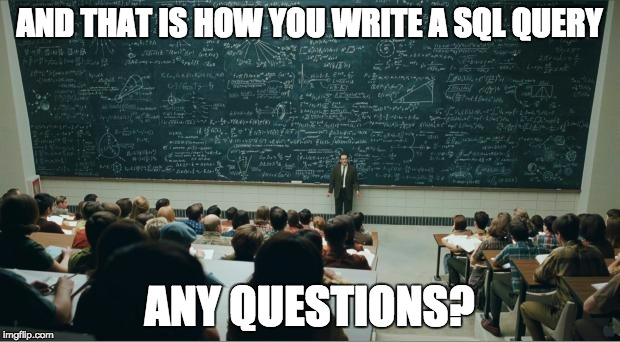

# 0x0D. SQL - Introduction

## Resources
- What is Database & SQL?
- A Basic MySQL Tutorial
- Basic SQL statements: DDL and DML (no need to read the chapter “Privileges”)
- Basic queries: SQL and RA
- SQL technique: functions
- SQL technique: subqueries
- What makes the big difference between a backtick and an apostrophe?
- MySQL Cheat Sheet
- MySQL 8.0 SQL Statement Syntax
- installing MySQL in Ubuntu 20.04

## Learning Objectives
At the end of this project, you are expected to be able to explain to anyone, without the help of Google:

## General
- What’s a database
- What’s a relational database
- What does SQL stand for
- What’s MySQL
- How to create a database in MySQL
- What does DDL and DML stand for
- How to CREATE or ALTER a table
- How to SELECT data from a table
- How to INSERT, UPDATE or DELETE data
- What are subqueries
- How to use MySQL functions

## Requirements
- Allowed editors: vi, vim, emacs
- All your files will be executed on Ubuntu 20.04 LTS using MySQL 8.0 (version 8.0.25)
- All your files should end with a new line
- All your SQL queries should have a comment just before (i.e. syntax above)
- All your files should start by a comment describing the task
- All SQL keywords should be in uppercase (SELECT, WHERE…)
- A README.md file, at the root of the folder of the project, is mandatory
- The length of your files will be tested using wc

## Tasks
0. List databases
1. Create a database
2. Delete a database
3. List tables
4. First table
5. Full description
6. List all in table
7. First add
8. Count 89
9. Full creation
10. List by best
11. Select the best
12. Cheating is bad
13. Score too low
14. Average
15. Number by score
16. Say my name
17. Go to UTF8
18. Temperatures #0
19. Temperatures #1
20. Temperatures #2

